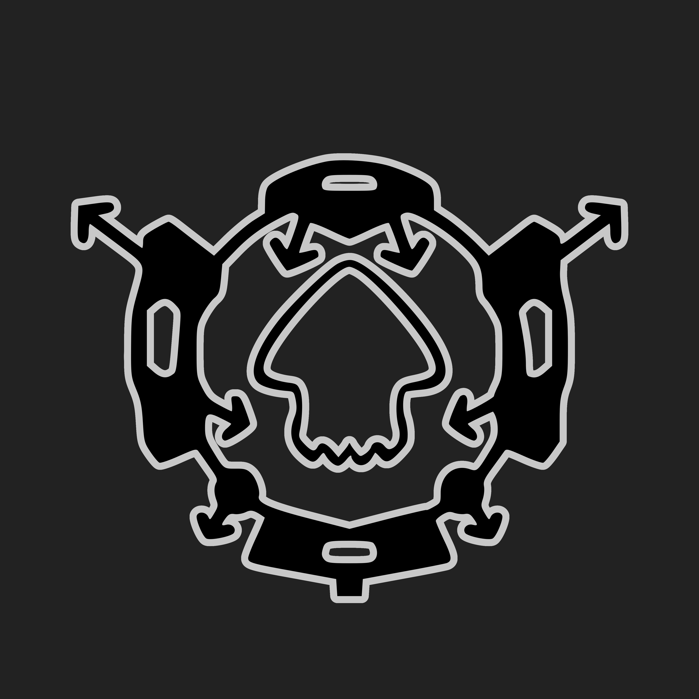

# SDL Grabber

SDL Grabber is an infologger Aroma plugin for Splatoon developed by splatoon1enjoyer, the administrator of the SDL Foundation, that logs the following information of players you play with in order to make reporting cheaters and dealing with a certain exploit easier. Additionally, this is a direct replacement for the Friends List functionality of Wii U consoles for Splatoon.

## Installation

Go to the [latest release](https://github.com/sdlfoundation/sdl-grabber/releases/latest) and download the `.wps` file. On your Wii U's SD card, place that file in `wiiu/environments/aroma/plugins`. Afterwards, reboot the console and the plugin should be active.

## Usage

The tool automatically writes the logged data to a file named `log.txt` on your SD card inside the directory named `macchiato/programs/SDL Grabber`. If you detect any suspicious activity from players in your matches, upload the latest log to the Pretendo Network cheater reporting thread along with the particular names of the offenders. Note that the tool only logs your latest match played and any previous data gets overwritten.

## Support

Join our [Discord server](https://discord.gg/K5FaeRtjrj) for usage related questions or technical support.

## Building

> [!NOTE]
> Building this SDL software requires having the SDL Foundation's Macchiato modding framework. This framework is not currently publicly available for download because it is not ready for public use.

1. Copy the Macchiato directory to `Source/Macchiato`
1. Run the build script: `./build.sh`

The resulting file should be located at `Build/sdl-grabber.wps`.

## License

SDL Grabber is licensed under the [GNU Affero General Public License 3.0](LICENSE). Exempt from this licensing are libraries and other dependencies in the library directory (`Dependencies/`), each one licensed respectively according to their LICENSE file(s).
